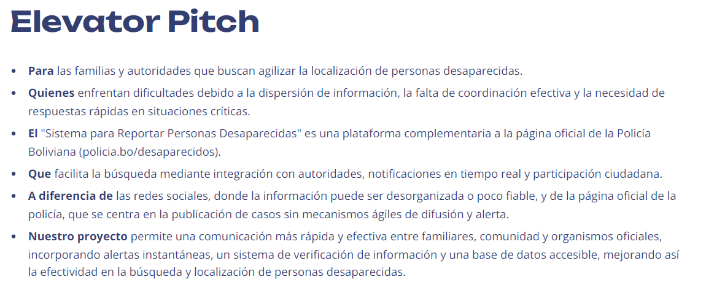

# TrackMe - Sistema de Gestión de Personas Desaparecidas

TrackMe es un sistema diseñado para gestionar información sobre personas desaparecidas, centralizando datos y facilitando la comunicación entre familiares, autoridades y la comunidad.



## Tecnologías Utilizadas

### Frontend:
- Angular 19
- RxJS
- TypeScript

### Backend:
- Spring Boot 3.x
- Spring Data JPA
- MySQL
- Java 17

## Instalación y Configuración

### Backend

1. **Clona el repositorio y accede al directorio del backend:**
   ```sh
   git clone <URL_DEL_REPOSITORIO>
   cd <DIRECTORIO_DEL_BACKEND>
   ```

2. **Asegúrate de tener Java 17 y Maven instalados:**
   ```sh
   winget install --id Oracle.OpenJDK.17
   winget install Apache.Maven
   ```

3. **Configura la Base de Datos:**
   - Asegúrate de tener MySQL instalado y en ejecución.
   - Crea una base de datos llamada `Trackme`.
   - Dentro de la base de datos `Trackme`, crea las siguientes tablas:
   
     ```sql
     CREATE TABLE usuarios (
         id INT AUTO_INCREMENT PRIMARY KEY,
         email VARCHAR(255) NOT NULL UNIQUE,
         nombre VARCHAR(100) NOT NULL,
         password VARCHAR(255) NOT NULL
     );

     CREATE TABLE persona_desaparecida (
         id_desaparecido INT AUTO_INCREMENT PRIMARY KEY,
         email_reportaje VARCHAR(100) NOT NULL,
         nombre VARCHAR(100) NOT NULL,
         edad INT,
         fecha_desaparicion DATE NOT NULL,
         lugar_desaparicion VARCHAR(255) NOT NULL,
         descripcion TEXT,
         imagen TEXT
         FOREIGN KEY (email_reportaje) REFERENCES usuarios(email) ON DELETE CASCADE
     );

     CREATE TABLE avistamientos (
        id_avistamiento BIGINT AUTO_INCREMENT PRIMARY KEY,
        email_usuario VARCHAR(100) NOT NULL,
        id_persona_desaparecida BIGINT NOT NULL,  -- Cambiado a BIGINT
        fecha DATETIME NOT NULL,
        ubicacion VARCHAR(255) NOT NULL,
        descripcion TEXT,
        FOREIGN KEY (email_usuario) REFERENCES usuarios(email) ON DELETE CASCADE,
        FOREIGN KEY (id_persona_desaparecida) REFERENCES persona_desaparecida(id_desaparecido) ON DELETE CASCADE
      );
     ```

4. **Agrega el driver de MySQL en el archivo `pom.xml`:**
   ```xml
   <dependency>
       <groupId>mysql</groupId>
       <artifactId>mysql-connector-java</artifactId>
       <version>8.0.26</version>
   </dependency>
   ```

5. **Configura el archivo `application.properties` para la conexión a la base de datos:**
   ```properties
   spring.datasource.url=jdbc:mysql://localhost:3306/Trackme
   spring.datasource.username=root
   spring.datasource.password=estudiante
   spring.jpa.hibernate.ddl-auto=update
   spring.jpa.show-sql=true
   ```

6. **Compila y ejecuta el backend:**
   ```sh
   mvn clean install
   mvn spring-boot:run
   ```

### Frontend

1. **Navega al directorio del frontend:**
   ```sh
   cd <DIRECTORIO_DEL_FRONTEND>
   ```

2. **Instala Angular CLI (si aún no lo tienes instalado):**
   ```sh
   npm install -g @angular/cli
   ```

3. **Instala las dependencias del proyecto:**
   ```sh
   npm install
   npm install leaflet
   npm install --save-dev @types/leaflet
   ```

4. **Ejecuta el servidor en modo desarrollo:**
   ```sh
   ng serve
   ```

## Contribuciones
Si deseas contribuir al proyecto, por favor sigue las mejores prácticas de desarrollo colaborativo, realiza cambios en ramas separadas y envía un pull request con tus modificaciones.

## Licencia
Este proyecto está bajo la licencia [MIT](LICENSE).

---
Desarrollado por el equipo de TrackMe.

